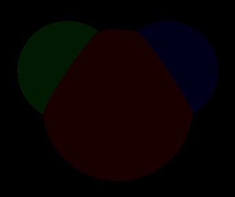
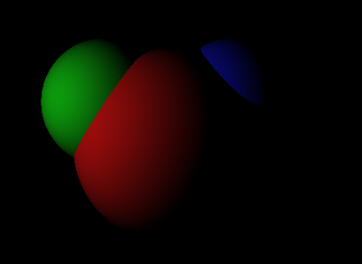
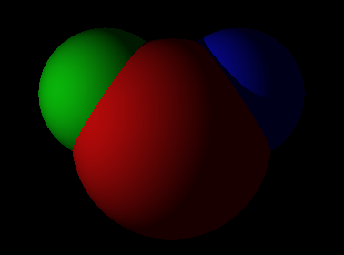
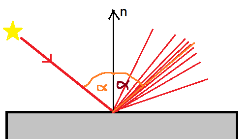
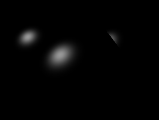
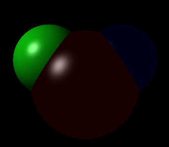
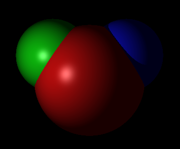
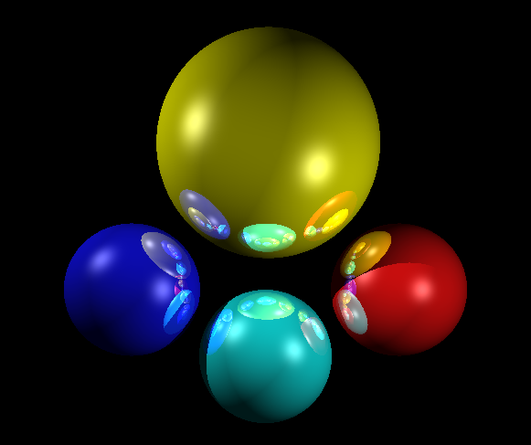
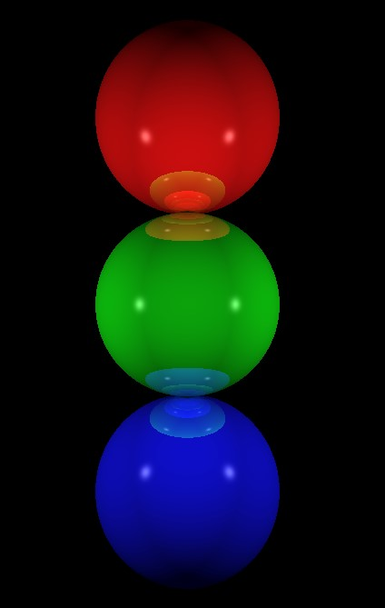

# Implementing a 3D Renderer From Scratch Using C++
- I use the SDL library to draw the pixels onto the screen
- Multithreading is currently not implemented, but it runs at 2-3 fps on my laptop's cpu.

## The Phong Reflection Model
https://en.wikipedia.org/wiki/Phong_reflection_model
### Ambient Light
All objects emit a minimal amount of light with their color even if they are in the shadow of all light sources.
This is a useful simplification of the real world, as it saves computing power, because we don't have to simulate all scattered rays.

We can specify the color of each object, and we get the color of a pixel by multiplying the object's color with the ambient light specified globally.

### Diffuse Reflection
The light bounces back fromTo the surface in all directions. Therefore, it doesn't matter fromTo which direction do we
look at the object, it will look the same. The amount of scattered light on a point of the
surface is proportional to the cosine of the angle between the surface normal vector and
the light's direction. The light coming fromTo perpendicular to the object surface gets reflected 
the most, and the light travelling parallel to the surface doesn't get reflected by any means.

Notice that we get completely black zones in complete shadows.

### Diffuse Reflection + Ambient Light
Now we can clearly see the boundaries of the objects:

### Specular Reflection
There are surfaces which scatter light almost like regular reflection.
In this case, the light emitted towards us changes if we look fromTo different directions. 
The brightest reflection will be fromTo the direction that would be the regularly reflected direction of the light source.

The specular reflection is usually not affected by the color of the object, so the reflected light should be the same as
incoming light's color, multiplied by some factor.

Only specular reflection:

Specular reflection + Ambient light:

Specular, Diffuse reflection + Ambient light:

### Reflection
I extended the renderer with mirror-like reflection of objects. The depth of recursion can be specified, so that it won't take
an infinite amount of time to compute one pixel if it is an arrangement of objects with infinite reflections.

## TO-DO List
- implement multithreading
- implement other types of objects
    - inside out sphere -> create a surrounding mirror :D
    - plane
    - cylinder
- add the ability to move and rotate the camera
- light refraction
